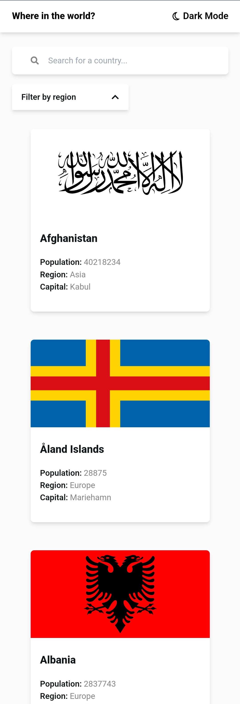

# Frontend Mentor - REST Countries API with color theme switcher solution

This is a solution to
the [REST Countries API with color theme switcher challenge on Frontend Mentor](https://www.frontendmentor.io/challenges/rest-countries-api-with-color-theme-switcher-5cacc469fec04111f7b848ca).
Frontend Mentor challenges help you improve your coding skills by building realistic projects.

## Table of contents

- [Overview](#overview)
    - [The challenge](#the-challenge)
    - [Screenshot](#screenshot)
    - [Links](#links)
- [My process](#my-process)
    - [Built with](#built-with)
    - [What I learned](#what-i-learned)
    - [Continued development](#continued-development)
- [Author](#author)

## Overview

### The challenge

Users should be able to:

- See all countries from the API on the homepage
- Search for a country using an `input` field
- Filter countries by region
- Click on a country to see more detailed information on a separate page
- Click through to the border countries on the detail page
- Toggle the color scheme between light and dark mode

### Screenshot

Desktop light version

Mobile light version

### Links

- Solution URL: [Add solution URL here](https://your-solution-url.com)
- Live Site URL: [Add live site URL here](https://your-live-site-url.com)

## My process

### Built with

- Semantic HTML5 markup
- CSS custom properties
- Flexbox
- CSS Grid
- Mobile-first workflow
- [Tailwind CSS](https://tailwindcss.com) - CSS Framework
- [Next.js](https://nextjs.org/) - React framework

### What I learned

During this project, I learned how to integrate APIs into a Next.JS application and implement dynamic theming with
Tailwind CSS.

### Continued development

1. Sorting options
2. Pagination
3. Detailed Country information
4. Map Integration

## Author

- Website - [Makechi Eric](https://love-makechi.web.app)
- Frontend Mentor - [@Makechi02](https://www.frontendmentor.io/profile/Makechi02)
- Twitter - [@OEMakbe](https://www.twitter.com/OEMakbe)
- Instagram - [@oemakbe](https://www.instagram.com/oemakbe)